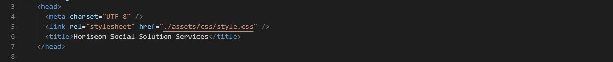
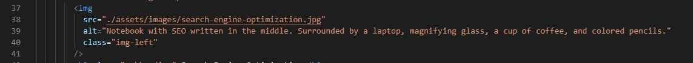
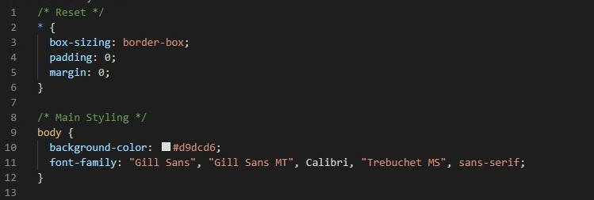

# Horiseon Social Solution Services Webpage

## Description

This is a company webpage built using HTML and CSS. The main purpose of this project was to refactor the existing code in order to improve its database and make sure the code was running perfectly, making it more efficient and maintainable. Below are the main changes made to improve the code and functionability, as well as screenshot of some of the changes made for reference.

- Company's name has been added to the webpage title in the header;

  

- Acessible alt attributes have been added to meet accessibility standards;

  

- HTML semantic elements have been corrected;
- All links have been tested and fixed as needed;
- CSS selectors and properties have been consolidated wherever possible;
- CSS has been organized to follow semantic structure of the HTML elements;
- Comments have been added to HTML and CSS to keep it organized and better to read.

  

## Built With

- HTML
- CSS

## Website

copy and paste webpage

## ©️ 2019 Horiseon Social Solution Services, Inc.
